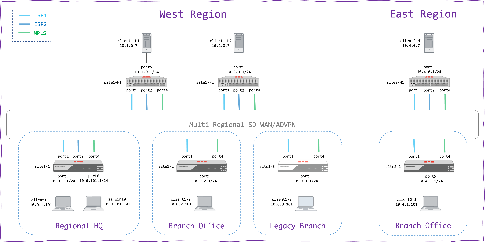

# Jinja Orchestrator 7.4 (for Fortinet SD-WAN/ADVPN)

NOTE: This is an experimental release currently under active testing. Please use it with care! 

The documentation is now available in the [Wiki](https://github.com/fortinet-solutions-cse/sdwan-advpn-reference/wiki).

For a mature release, we recommend using the `release/7.2` branch of this repository!

## Example Project



This project is fully rendered under "dynamic-bgp-on-lo/rendered" directory.  
It can be rendered offline as follows:

```
./render_config.py -f dynamic-bgp-on-lo -p dynamic-bgp-on-lo/projects/Project.dualreg.mixed.nocert.j2 -i dynamic-bgp-on-lo/projects/inventory.dualreg.mixed.json
```

NOTE: The following prerequisites must be installed prior to using the offline renderer (tested on Python 3.11):

```
pip3 install jinja2 ansible netaddr
```